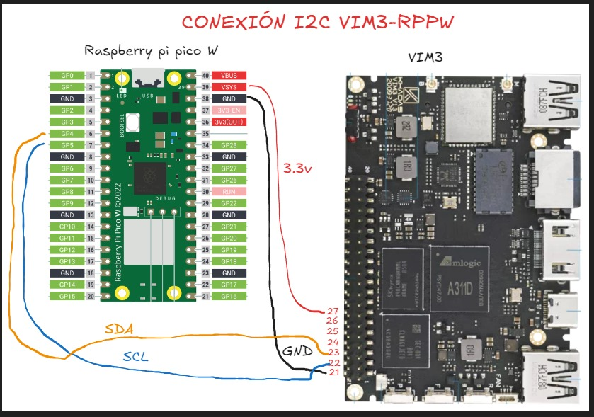

# Tutorial I2C
Estos documentos fueron realizados por Manuel Cely, tienen un funcionamiento correcto y son bastante claros para
poder llevar a cabo la conexión entre la VIM3 y la RPP mediante I2C,
estos tutoriales se deben seguir en este orden:
- **RPP_I2C.pdf**: Muestra la parte del código y preparación de la Raspberry Pi Pico, su respectivo código se encuentra en `examples/i2c/i2c_conf_irq.c`. Es de notar que anter de conectar la RPP a la VIM3 se requiere hacer la correcta programación.
- **VIM3_I2C.pdf**: Explica cómo se debe configurar los overlays de la VIM3 para permitir la conexión I2C, propone 3 ejemplos que se encuentran en la carpeta `examples/i2c`: uno en c (`i2c_master.c`), y otros dos en python (`i2c_master_python.py` y `i2c_master_json_python.py`).

Aquí se muestran los pines utilizados para esta conexión:
